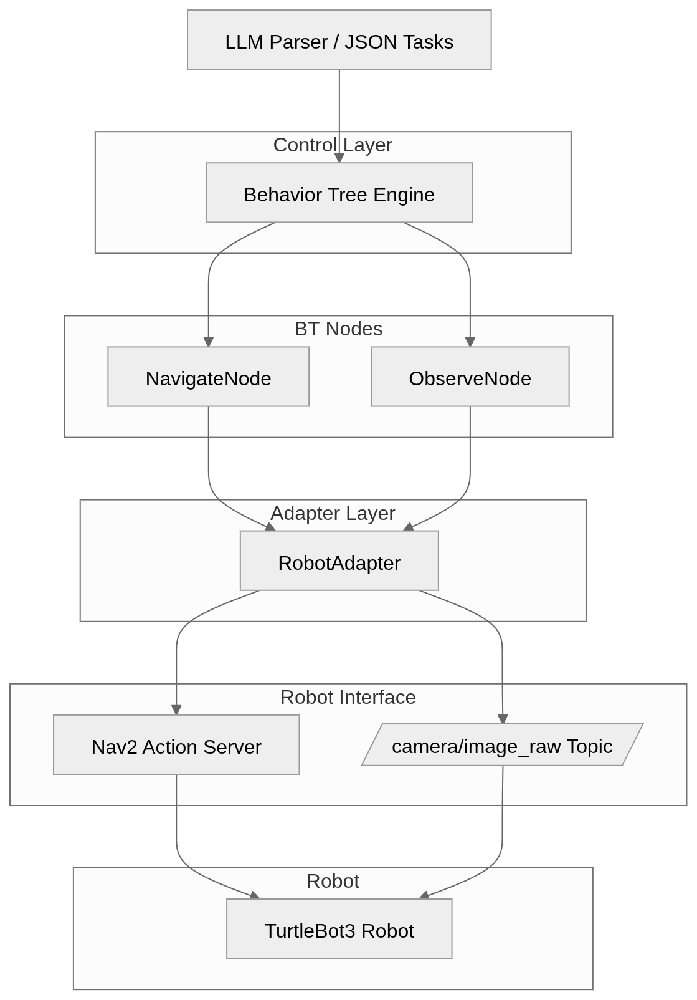
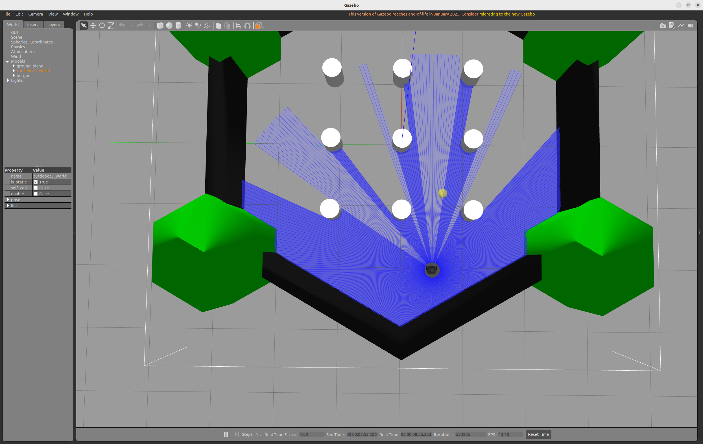
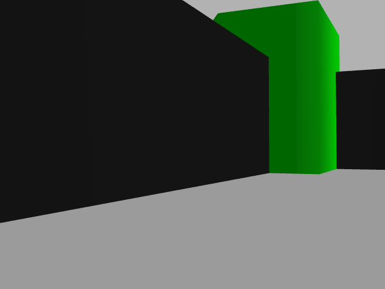
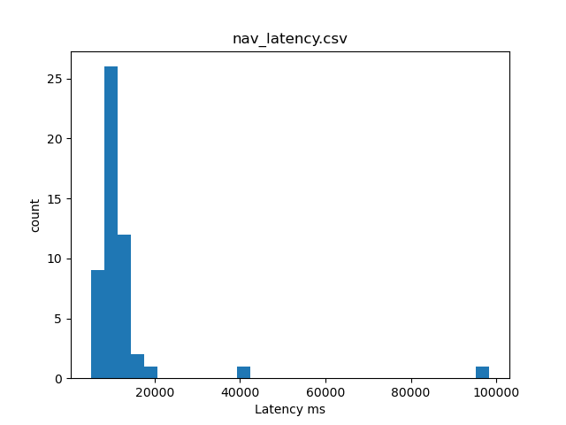
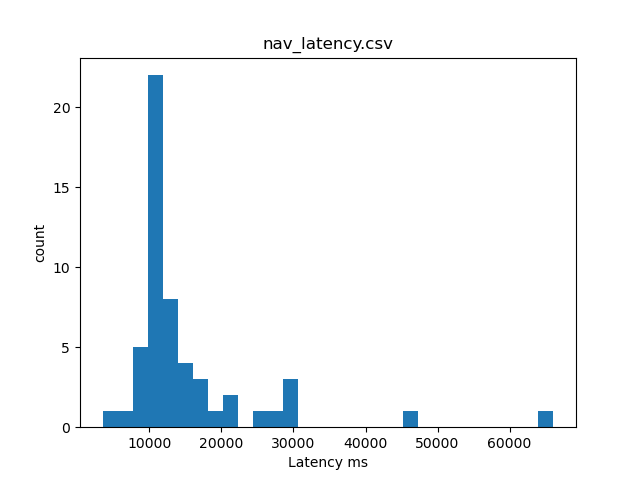
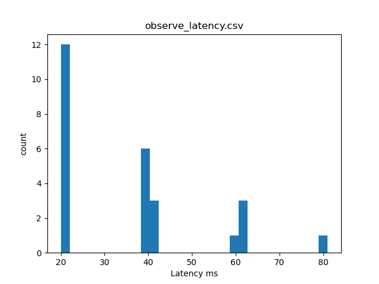
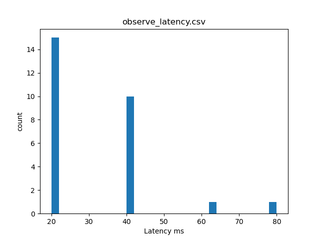

## agirobot

一个基于 ROS2 的机器人任务执行系统，使用行为树作为核心执行引擎，实现跨机器人平台的任务复用与高性能控制。

本项目重点在于系统架构设计与工程实现，而非算法开发，目标是构建一个可扩展、可复用、可优化的机器人控制框架。

## 项目特点
使用 Behavior Tree 统一管理任务执行流程
支持不同机器人平台复用同一行为逻辑（TurtleBot3 / TIAGo）
基于 ROS2 + Nav2 构建完整导航系统
提供 QoS、零拷贝、线程绑定等性能优化方案
支持仿真环境快速验证与复现

核心结论：

Same behavior logic, different robots, no modification required

## 项目结构
```
agirobot/
├── README.md
├── src/
│   ├── turtlebot3/
│   ├── turtlebot3_msgs/
│   ├── turtlebot3_simulations/
│   ├── agirobot_control/
│   ├── agirobot_perception/
│   └── agirobot_demo/
├── launch/
├── maps/
├── worlds/
└── scripts/
```
## 说明：

agirobot_control：行为树执行、任务调度、ROS2 Action 封装
agirobot_perception：传感器数据处理（相机 / LiDAR 等）
agirobot_demo：演示用 launch 文件与任务配置
worlds：Gazebo 仿真环境
maps：SLAM 构建的地图
系统架构

系统采用“任务生成 + 行为执行分离”的设计：

上层：任务定义（可扩展为 LLM / API）
中层：Behavior Tree 执行引擎（C++）
下层：Robot Adapter（适配不同机器人）

行为树作为唯一执行入口，不依赖具体机器人实现。

### 

## 视频演示


## 演示内容包括：

TurtleBot3 任务执行（导航 + 观测）
TIAGo 复用同一行为树执行
系统性能优化对比
快速开始

1. 启动仿真（TurtleBot3）
export TURTLEBOT3_MODEL=burger
ros2 launch turtlebot3_gazebo turtlebot3_world.launch.py
ros2 launch turtlebot3_navigation2 navigation2.launch.py use_sim_time:=true

运行行为树：

ros2 run agirobot_control bt_main /path/to/behavior_tree.xml --robot turtlebot3
2. 启动 TIAGo
ros2 launch tiago_gazebo tiago_gazebo.launch.py is_public_sim:=True

运行同一行为树：

ros2 run agirobot_control bt_main /path/to/behavior_tree.xml --robot tiago
跨机器人复用

同一份 Behavior Tree，无需修改代码，即可在不同机器人上运行。

差异通过 Robot Adapter 层处理：

TurtleBot3：移动底盘
TIAGo：移动底盘（可扩展机械臂）

行为层完全一致。

## Observe 结果部分展示：

<p align="center">
  
  
</p>

<p align="center">
  
  
</p>


## 性能优化

本项目对 ROS2 通信链路进行了系统级优化：

优化策略
线程绑定（CPU affinity）
QoS 调整（KeepLast + best_effort）
intra-process 通信（零拷贝）
降低消息队列深度

## 关键代码示例：

CPU_SET(2, &cpuset);
pthread_setaffinity_np(...);

rclcpp::QoS qos(rclcpp::KeepLast(1));
qos.best_effort();

options.use_intra_process_comms(true);

## 性能结果

导航任务延迟对比：
<p align="center">
  
  
</p>

<p align="center">
  
  
</p>

优化前：

Mean: 15180.69

优化后：

Mean: 12640.13

整体下降约 16%

观测任务延迟基本稳定，无明显退化。

仿真问题（TIAGo Gazebo 崩溃）

## 部分环境下运行 TIAGo 仿真会出现：

nouveau_pushbuf_data: Assertion `kref' failed
gzserver exit code -6

## 原因：

使用 nouveau 开源显卡驱动
Gazebo 渲染复杂模型时崩溃

解决方案：

export LIBGL_ALWAYS_SOFTWARE=1

使用 CPU 进行软件渲染，可保证稳定运行。

项目定位

本项目重点展示：

ROS2 系统设计能力
行为树任务调度能力
跨机器人架构抽象能力
DDS / QoS 性能优化能力

不涉及复杂算法开发，侧重工程实现与系统整合。

## 总结

本项目实现了一个硬件无关的机器人控制系统：

行为树作为统一执行层
ROS2 + Nav2 作为底层框架
通过 Adapter 支持多机器人

## 核心目标是：

在不修改行为逻辑的情况下，实现任务在不同机器人之间复用。